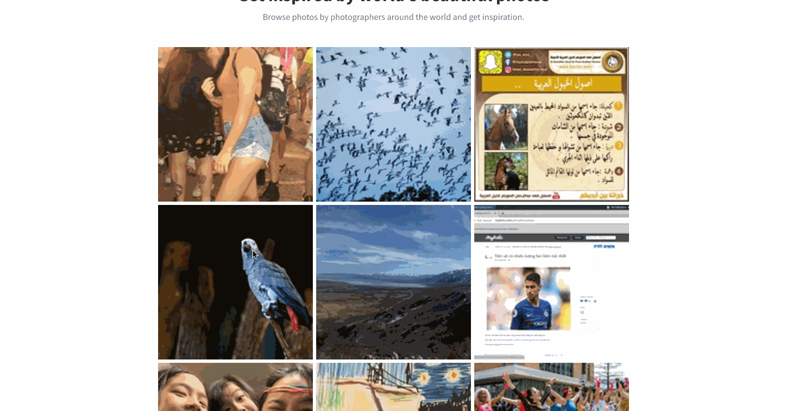

# Photo Browser

A React-based project that allows users to browse photos and search photos.

## How to run

1. Clone or download the project

2. Move to the project directory

If you downloaded:

`cd PhotoBrowser-master`

If you cloned:

`cd PhotoBrowser`

3. Install required libraries (Takes a couple of minutes)

`yarn install`

4. Run

`yarn start`

5. Open the page

Go to http://localhost:3000

## Functionality

### Browse photos from Flickr infinitely (scroll to load more photos)

### View large-size photo (Click the photo)

### Seach photos (Toggle "Search mode" button and type the word you like ('cat'))

## Libraries

React, Bootstrap, webpack, dotenv
